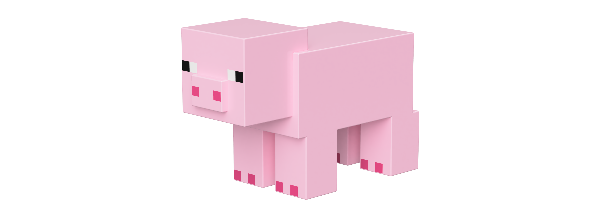

# Minecraft Pig

## Documentation

- [Design.md](documentation/design.md) provides information about the design of the Minecraft Pig. First, it provides information about the Minecraft Pig's colour scheme. Thereafter, it provides information about the grid system used to design the Minecraft Pig.

